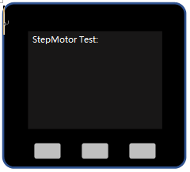

### I. Test and Run

1. DC Power and Motors be linked with board.

2. Reset M5Stack Core, press and hold on buttom `B` to boot into OFFLINE mode. M5Stack LCD will display as below. Then, if you press buttom `A`(or `B`), stepping motors will rotate steadily.




### II. How to Develop

1. 重启M5Stack之后，界面显示如下，提示连接板子的热点


打开手机wifi，连接热点“M5Stack-c9c8”
3、	连接上之后，打开手机浏览器，在网址框输入“192.168.4.1”
出现下图1界面之后，选中家里路由WIFI名，并输入WIFI密码，点击“连接”，
此时，观察M5Stack界面，如果出现连接成功后，板子会重启，显示下图2
4、	在PC的浏览器上，输入io.m5stack.com
5、	注册M5Stack账号
6、	点击刚刚打开的网页IDE上的“Add” 
7、	将M5Stack Core屏幕显示的Check Code填入绑定设备对话框，Check Code是一次性随机的，60秒会刷新一次，仅仅用于设备绑定验证。
8、	点击“Project”，新建一个步进电机工程
9、	将下面的代码复制粘贴到main.py，并点击保存。
10	点击左下角的“Upload Local FIile”，上传motor.py和i2c_bus.py
11	点击左下角的“Upload & Run”，通过wifi将文件都上传到M5Stack板子，此时

```python

from m5stack import lcd
import motor 

lcd.clear()
lcd.setCursor(0, 0)
lcd.setColor(lcd.WHITE)
lcd.print("StepMotor Test: ")

stepmotor_0 = motor.StepMotor(0x70)

while True:
  if buttonA.wasPressed(): 
    stepmotor_0.StepMotor_XYZ(0, 0, 0, 500)
  elif buttonB.wasPressed():
    stepmotor_0.StepMotor_XYZ(10.5, 10.5, 10.5, 500)


  
```


```python

from m5stack import lcd
import motor
import utime

lcd.clear()
lcd.setCursor(0, 0)
lcd.setColor(lcd.WHITE)
lcd.print("StepMotor Test: ")

stepmotor_0 = motor.StepMotor(0x70)

stepmotor_0.StepMotor_XYZ(0, 0, 0, 500)
utime.sleep(3)
stepmotor_0.StepMotor_XYZ(10.5, 10.5, 10.5, 500)
utime.sleep(3)
stepmotor_0.StepMotor_XYZ(0, 0, 0, 500)

```