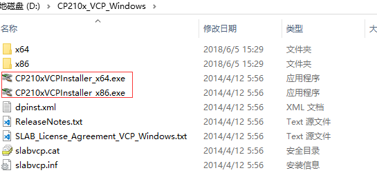
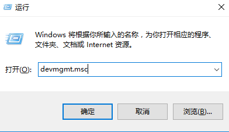
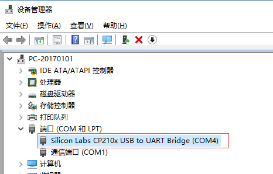
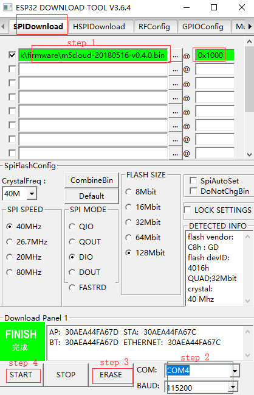

# M5Stack USB Downloader User Guide

### CONTENT

- [1. Download USB Driver](#1-download-usb-driver)
- [2. Download Firmware](#2-download-firmware)
- [3. Burn to board](#3-burn-to-board)

#### 1. Download USB Driver

Click the follow link for downloading CP210x USB Driver

https://www.silabs.com/products/development-tools/software/usb-to-uart-bridge-vcp-drivers

Unzip the USB Driver file and double-click the executable file as shown below




(Windows 32 bits，execute CP210xVCPInstaller_x68.exe; Windows 64 bits，execute CP210xVCPInstaller_x64.exe; )

#### 2. Download Firmware
  
Download the firmware you need.
  
Now, the firmware I downloaded named `m5cloud-20180516-v0.4.0.bin`
and it saved at `~/smbshare` on Linux

#### 3. Burn to board
 |  |  
---|---|---
Windows | Linux | MacOS

***Windows***

*1. Check your usb driver and confirm serial port*

Press `win+r` and input `devmgmt.msc`, then press `Enter` to open device managment on windows



Then plug in your board check whether there is a new usb driver exist and confirm the serial port which board connects to PC as shown below(now my serial port is `COM4`)




*2. Download firmware via esptool*
 M5Stack USB Downloader is connected with your board and PC. Open Flash Download Tools([点击下载](https://www.espressif.com/sites/default/files/tools/flash_download_tools_v3.6.4.rar)) apply by Espressif, choose `ESP32 DownloadTool` option and execute three steps ( *choose firmware file, your serial port, erase and program flash* ) as shown below




***MacOS/Linux***

*1. Check port on Linux and MacOS*

  M5Stack USB Downloader is connected with your board and PC. To check the device name for the serial port of M5Stack USB Downloader, run this command two times, first with M5Stack USB Downloader unplugged, then with plugged in. The port which appears the second time is the one you need:

  Linux

  ```
  ls /dev/tty*
  ```
  
  MacOS

  ```
  ls /dev/cu.*
  ```


*2. Adding user to `dialout` on Linux*

The currently logged user should have read and write access the serial port over USB. On most Linux distributions, this is done by adding the user to `dialout` group with the following command:

  ```
  sudo usermod -a -G dialout $USER
  ```
Now, my serial port named `ttyUSB0` and my firmware named `m5cloud-20180516-v0.4.0.bin`

*3. Download your firmware via M5Stack USB Downloader*
  - Installing esptool：
    ```
    pip install esptool
    ```
  - Erase flash on M5Stack:
    ```
    esptool.py --chip esp32 --port /dev/ttyUSB0 erase_flash
    ```
  - Download firmware to M5Stack: 
    ```
    esptool.py --chip esp32 --port /dev/ttyUSB0 write_flash --flash_mode dio -z 0x1000 m5cloud-20180516-v0.4.0.bin
    ```
